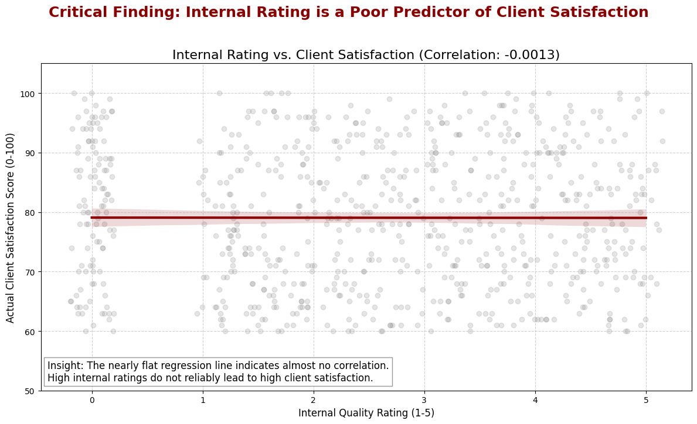
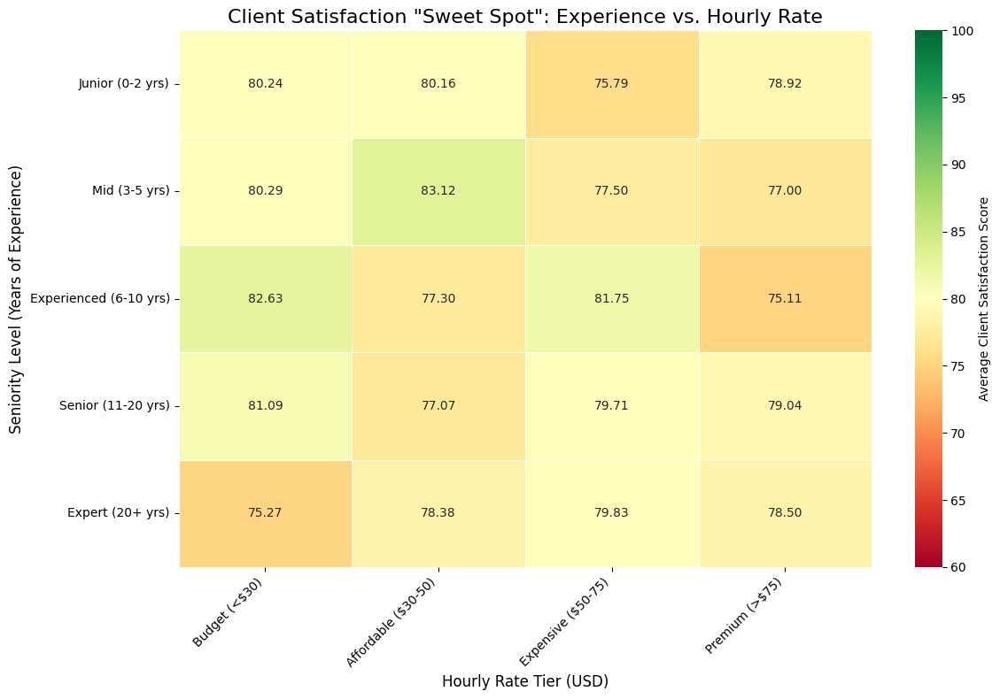
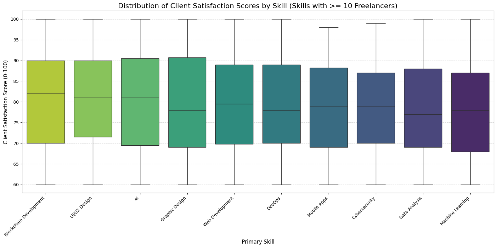
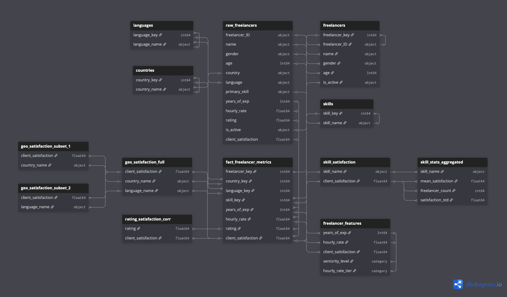

# Global Freelancer Marketplace Analysis

### **Table of Contents**
1. [Executive Summary](#executive-summary)
2. [Business Problem](#business-problem)
3. [Key Findings & Visualizations](#key-findings--visualizations)
4. [Strategic Recommendations](#strategic-recommendations)
5. [Data Model (ERD)](#data-model-erd)
6. [Technical Setup & Usage](#technical-setup--usage)

---

### **Executive Summary**
This project identifies key drivers of client satisfaction and platform retention for a global freelancer marketplace. Analyzing a dataset of 1,000 freelancers, the study reveals that **Blockchain Development** and **UI/UX Design** are the highest-value skills.

**Critical Alert:** The platform's current internal "Star Rating" system has a **-0.0013 correlation** with actual client satisfaction, rendering it useless for predicting project success.

---

### **Business Problem**
The platform faces challenges in **churn reduction** and **quality matching**. This analysis aims to answer:
*   **Talent Acquisition:** Which skills consistently drive high Client Satisfaction Scores (CSAT)?
*   **Algorithm Accuracy:** Is the internal "Star Rating" a valid metric for ranking talent?
*   **Pricing Strategy:** What is the optimal experience-to-cost ratio for budget clients?

---

### **Key Findings & Visualizations**

#### **1. The "Internal Rating" Failure**
*   **Insight:** There is no statistical relationship between the platform's internal rating (1-5 stars) and actual client satisfaction. High-rated freelancers are just as likely to fail as low-rated ones.
*   **Impact:** This destroys client trust and recommendation accuracy.

#### **2. The "Value" Sweet Spot**
*   **Insight:** Freelancers with **6–10 years of experience** charging **<$30/hr** yield the highest satisfaction (**82.6/100**). Conversely, "Experts" (20+ years) at this price point underperform significantly.
*   **Action:** Adjust search algorithms to surface mid-senior talent for budget-conscious clients.

#### **3. High-Performance Verticals**
*   **Insight:** Technical skills significantly outperform generalist roles.
    *   **Blockchain Dev:** 80.5 Avg Score
    *   **UI/UX Design:** 80.2 Avg Score
    *   **AI:** 80.1 Avg Score

---

### **Strategic Recommendations**
1.  **Algorithm Overhaul:** Immediately deprecate the current internal rating system. Implement a new score weighted by `Project Success Rate` and `Rehire Rate`.
2.  **Marketing Focus:** Shift acquisition budget toward **Blockchain** and **AI** talent, as these categories drive the highest CSAT.
3.  **Geography Optimization:** Tailor regional marketing strategies to highlight top-performing countries (see [Country Chart](images/country_performance.png)).

---

### **Data Model (ERD)**
To optimize analysis, the raw flat-file data was normalized into a **Star Schema**, creating specific Dimension tables for Skills, Locations, and Freelancers, centered around a Fact table of project metrics.

---

### **Technical Setup & Usage**

#### **Prerequisites**
*   Python 3.x
*   Jupyter Notebook

#### **Data Cleaning Pipeline**
The analysis includes a robust ETL process:
*   **Normalization:** Standardized `gender` and `is_active` fields.
*   **Type Casting:** Converted currency strings to floats and percentages to integers.
*   **Null Handling:** Coerced non-numeric errors to `NaN` and filtered low-sample-size outliers.

---

## 📬 Contact
**Selim Najaf**

*   **LinkedIn:** [linkedin.com/in/selimnajaf-data-analyst](https://www.linkedin.com/in/selimnajaf-data-analyst/)
*   **GitHub:** [github.com/SelimNajaf](https://github.com/SelimNajaf)
